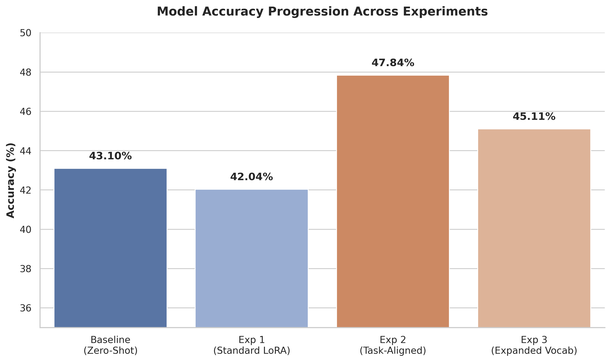

# Spatial Understanding for Small Vision-Language Models

<p align="center">
Parameter-Efficient Adaptation of Small Vision-Language Models for Spatial Reasoning
</p>

---

## Overview

This repository investigates methods to improve spatial reasoning capabilities of small Vision-Language Models (~500M–1B parameters) using parameter-efficient fine-tuning.

The focus is on improving performance on spatial understanding tasks including:

- Relative positioning (left / right / behind)
- Depth reasoning (closest / furthest)
- Object counting

Evaluation is performed on:

`nyu-visionx/CV-Bench`

---

## Objective

Improve spatial understanding in small VLMs while preserving parameter efficiency.

### Model

`HuggingFaceTB/SmolVLM-500M-Instruct`

### Hardware

`RTX 5060 (8GB VRAM)`

### Methodology

- LoRA Fine-Tuning
- Spatial data filtering
- Task-aligned instruction formatting
- Strict output constraint alignment

---

## Baseline Benchmark

### Evaluation Setup

Dataset:

`nyu-visionx/CV-Bench`

Test Split:

`2638 samples`

### Baseline Performance

| Model | Accuracy |
|:------|----------:|
| SmolVLM-500M-Instruct | 43.10% |

> **Note on Model Dynamism:** Small VLMs (~500M parameters) are highly dynamic and extremely sensitive to prompt phrasing and image resolution. The baseline score of 43.10% reflects its performance on a standard, simple conversational prompt.

---

# Experiment 1 — Standard LoRA Fine-Tuning

## Approach
- LoRA adaptation
- LLaVA-instruct subset
- Standard conversational supervision

## Result

| Configuration | Accuracy |
|:--------------|----------:|
| Baseline | 43.10% |
| Standard LoRA | 42.04% |

## Analysis
Performance degraded slightly. Observed failure modes:
- Format mismatch between training and evaluation
- Under-training
- Weak adherence to strict multiple-choice output constraints

The model learned conversational behavior but struggled to reliably output exact benchmark answer formatting.

---

# Experiment 2 — Task-Aligned Multiple Choice Fine-Tuning

## Approach
Spatial examples were filtered and reformatted into strict multiple-choice supervision.

Key modifications:
- Dynamic option generation
- Spatial task filtering
- LoRA fine-tuning
- Instruction alignment with benchmark evaluation format
- Increased training duration

## Result
Accuracy improved to **47.84%**. By fine-tuning the model on a highly restrictive instruction template, it successfully internalized the formatting logic alongside the spatial geometric concepts.

---

# Experiment 3 — Expanding Vocabulary

A subsequent ablation study attempted to improve performance by expanding the spatial vocabulary filter to include terms like:
- `above`
- `inside`
- `outside`

This increased dataset size but reduced final accuracy to **45.11%** (a 2% gain over baseline, but lower than Experiment 2). 

This suggests that for 500M parameter models, dataset purity, task specificity, and strict format alignment are significantly more critical than indiscriminately increasing dataset volume.

---

## Final Results

| Configuration | Accuracy |
|:--------------|----------:|
| Baseline (Simple Prompt) | 43.10% |
| Fine-Tuned LoRA (Strict Prompt) | 47.84% |

### Improvement
**+4.74%**



---

## Analysis

Evaluation was performed using highly restrictive answer formatting.

The baseline model frequently violated formatting constraints despite demonstrating partial spatial understanding.

Task-aligned fine-tuning improved instruction adherence while preserving benchmark-aligned spatial prediction capability.

These observations suggest that small VLM performance depends not only on representation quality but also on structural alignment between supervision and evaluation.

---

## Repository Structure

```text
spatial-vlm/
│
├── datasets/
│   └── preprocess.py
│
├── models/
│   └── vlm/
│       └── smolvlm.py
│
├── training/
│   └── finetune.py
│
├── evaluation/
│   ├── benchmark.py
│   └── visualize.py
│
├── experiments/
│   └── depth_finetune/
│
├── run.py
├── setup.py
├── README.md
└── requirements.txt
```

### datasets/

Dataset loading and preprocessing.

### models/

Model loading and LoRA adaptation.

### training/

Fine-tuning pipeline.

### evaluation/

Benchmark scripts and accuracy evaluation.

### experiments/

Saved adapters and experimental artifacts.


## Quick Start Pipeline

### 1. Install Dependencies

```bash
pip install -r requirements.txt
```

### 2. Train the Model

```bash
python run.py --mode train
```

### 3. Evaluate the Models

Evaluate Base Model:

```bash
python run.py --mode eval-base
```

Evaluate Fine-Tuned LoRA Model:

```bash
python run.py --mode eval-tuned
```

### 4. Generate Visualizations

```bash
python run.py --mode visualize
```

---

## Key Takeaway

Small Vision-Language Models benefit significantly from task-aligned supervision.

Instruction formatting and evaluation alignment can materially influence benchmark performance alongside representation learning.

---

<p align="center">

Spatial Reasoning • Parameter Efficient Fine-Tuning • Small VLMs

</p>